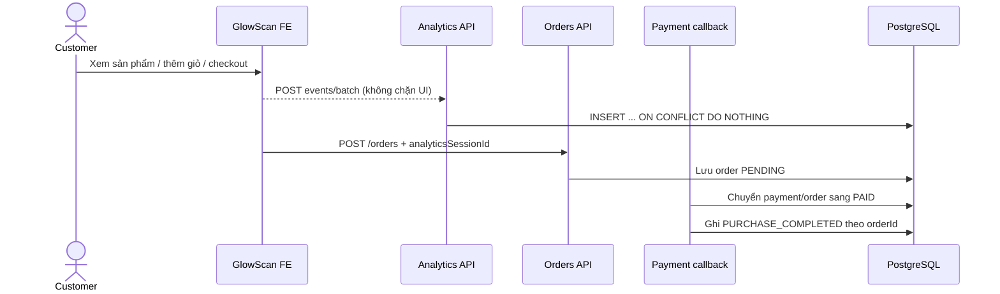
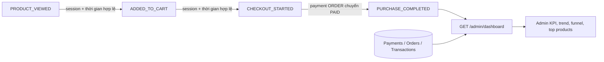

# Admin Flow V2 — Ecommerce Analytics Dashboard

## Mục tiêu và phân quyền

`app_admin` là role duy nhất được gọi `GET /admin/dashboard`. Dashboard cung cấp
số liệu vận hành toàn hệ thống; không giới hạn theo clinic. Expert, Staff và
Clinic Manager không được xem endpoint này.

Dashboard không phải báo cáo kế toán. Hệ thống không quản lý giá nhập nên không
tính COGS, lợi nhuận gộp, biên lợi nhuận hay định giá tồn kho.

## Định nghĩa KPI

| KPI                           | Công thức                                                 | Nguồn authoritative        |
| ----------------------------- | --------------------------------------------------------- | -------------------------- |
| Đơn đã thanh toán             | Số order có payment `ORDER/PAID` trong kỳ                 | `payments.paidAt`          |
| Giá trị sản phẩm trước giảm   | Tổng `orders.subtotalVnd` của order đã thanh toán         | `orders`, `payments`       |
| Giảm giá                      | Tổng `orders.discountVnd`                                 | `orders`, `payments`       |
| Vận chuyển đã thu             | Tổng `orders.shippingFeeVnd`                              | `orders`, `payments`       |
| Tổng tiền order đã thu        | Tổng `payments.amountVnd` của `ORDER/PAID`                | `payments`                 |
| Hoàn tiền sản phẩm            | Tổng `REFUND/COMPLETED` có `orderId`                      | `transactions`             |
| Giá trị thanh toán trung bình | Tổng tiền order đã thu / số order đã thanh toán           | Giá trị tổng hợp phía trên |
| Phí tư vấn đã thu             | Tổng `CONSULTATION_PAYMENT/COMPLETED`                     | `transactions`             |
| Hoàn phí tư vấn               | Tổng `REFUND/COMPLETED` có `consultationId`               | `transactions`             |
| Hoa hồng nền tảng             | Tổng `COMMISSION/COMPLETED` chuyển vào `PLATFORM_REVENUE` | `transactions`             |

Tiền order đã thu và phí tư vấn đã thu là dòng tiền khách thanh toán, không phải
lợi nhuận. Hoàn tiền được trình bày riêng; V2 không tạo chỉ số net sales. Chỉ
transaction `COMMISSION → PLATFORM_REVENUE` được gọi là doanh thu hoa hồng của
GlowScan. Nạp ví không được tính vào bất kỳ KPI doanh thu nào.

## Tracking funnel first-party

FE duy trì một UUID phiên trong local storage. Phiên được giữ xuyên qua đăng
nhập và xoay sau 30 phút không hoạt động. FE gửi batch tối đa 20 event tới:

```http
POST /analytics/commerce/events/batch
```

Event client hợp lệ: `PRODUCT_VIEWED`, `ADDED_TO_CART`, `CHECKOUT_STARTED`.
`PURCHASE_COMPLETED` là event server-only và chỉ được ghi trong cùng transaction
khi callback thanh toán chuyển payment order sang `PAID`.

- `eventId` là khóa idempotency cho event client.
- Purchase có unique index theo `orderId` nên callback lặp không tăng conversion.
- Event không chứa IP, email, user-agent hoặc nội dung cá nhân.
- Cron 03:00 theo `Asia/Ho_Chi_Minh` xóa event quá 90 ngày.
- Không backfill các bước funnel trước ngày release.



## Tổng hợp funnel

Funnel strict được deduplicate theo `sessionId`. Một phiên chỉ vào bước sau khi
đã có bước trước với timestamp không sớm hơn bước trước.



Dashboard trả số session từng bước, conversion so với bước trước, conversion từ
view và `availableFrom`. `isPartial=true` khi kỳ được chọn bắt đầu trước ngày có
event đầu tiên. Không có event trả funnel 0 hợp lệ và cảnh báo chưa có coverage;
lỗi API phải được FE hiển thị thành lỗi có nút thử lại, không biến thành empty
state.

## Hợp đồng API

- `GET /admin/dashboard?range=7d|30d|90d`, mặc định `30d`.
- `period` dùng timezone `Asia/Ho_Chi_Minh` và bao gồm hôm nay.
- Trend luôn trả đủ từng ngày với giá trị 0.
- Response gồm `metrics`, `attention`, `trend`, `funnel`, `topProducts` và
  `recentActivity`.
- `POST /analytics/commerce/events/batch` là public để hỗ trợ guest nhưng vẫn
  nhận diện user nếu có session/Bearer hợp lệ; DTO không cho phép purchase giả.

Swagger DTO nằm trong `src/dashboard/dto` và `src/analytics/dto`. Logic tổng hợp
nằm trong DashboardModule; ingest, retention và purchase attribution nằm trong
CommerceAnalyticsModule. Order chỉ giữ opaque `analyticsSessionId` để nối phiên
với purchase.

## Giới hạn V2

- Không attribution theo campaign/referrer.
- Không theo dõi impression danh sách, tìm kiếm hoặc checkout abandonment theo
  field cụ thể.
- Không backfill view/cart/checkout lịch sử.
- Không tính thuế, COGS, lợi nhuận hoặc giá trị tồn kho.
- Top sản phẩm dùng giá trị dòng hàng trước phân bổ giảm giá.
